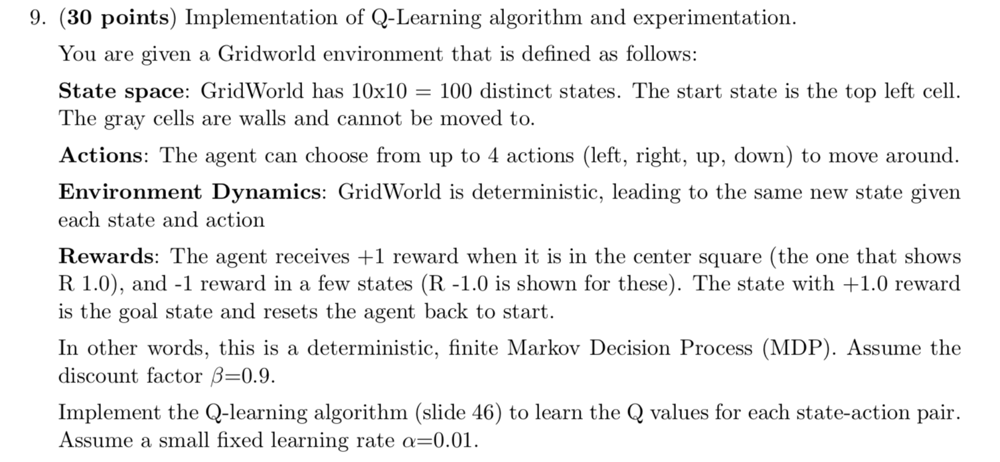
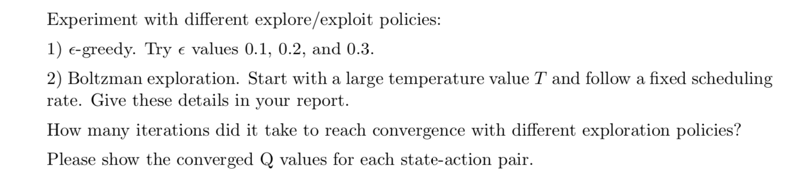
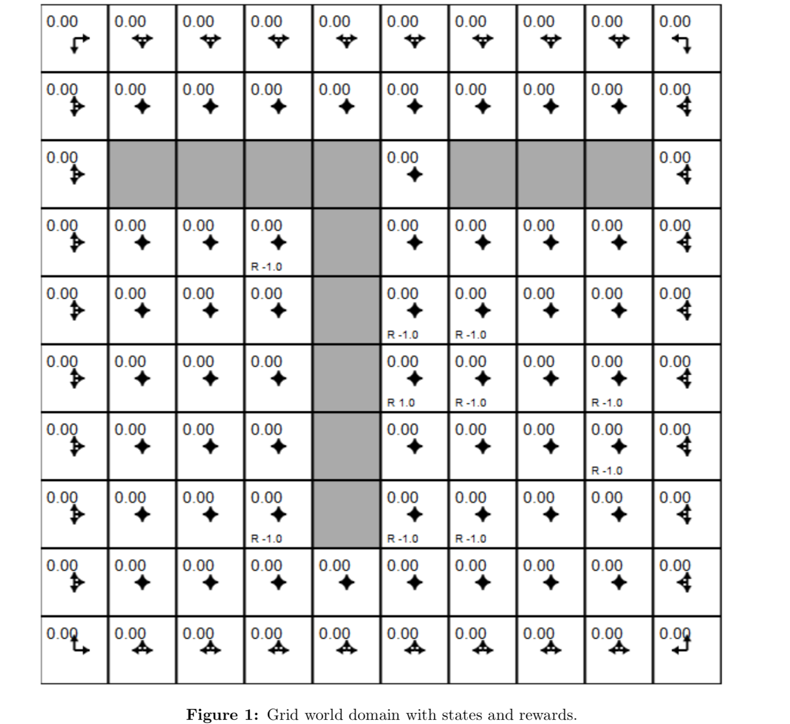

# Q-Learning_GridWorld

  

  

  

### Output:  

The boltzmann exploration temperature is calculated in each cell based on the number of visits made to that state. Hence, the exploration decreases with a fixed scheduling rate.  

From the plots and the Q learning matrix values it can be seen that the agent learns an optimal policy in all the cases. Though it learns the fastest when temperature is 10.  

